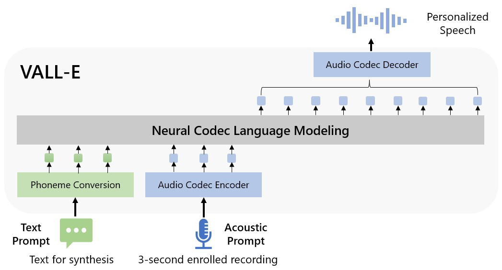

# VALL-E

An unofficial JAX implementation of [VALL-E](https://arxiv.org/abs/2301.02111),
which is a neural codec language model that can synthesize zero-shot TTS only with 3 seconds of audio.

</img>

## TODO

- [x] Implement VALL-E AR and NAR models
- [ ] Pytorch Implement and convert script
- [ ] Train script for VALL-E
- [ ] Implement EnCodec for tokenize audio
- [ ] Train single speaker model([KSS](https://www.kaggle.com/datasets/bryanpark/korean-single-speaker-speech-dataset))
- [ ] Train Multi-speaker model([AIHub](https://www.aihub.or.kr/aihubdata/data/view.do?dataSetSn=542))
- [ ] Add demos and pretrained models


## Citations

```
@article{wang2023neural,
  title={Neural Codec Language Models are Zero-Shot Text to Speech Synthesizers},
  author={Wang, Chengyi and Chen, Sanyuan and Wu, Yu and Zhang, Ziqiang and Zhou, Long and Liu, Shujie and Chen, Zhuo and Liu, Yanqing and Wang, Huaming and Li, Jinyu and others},
  journal={arXiv preprint arXiv:2301.02111},
  year={2023}
}
```

```
@article{defossez2022highfi,
  title={High Fidelity Neural Audio Compression},
  author={Défossez, Alexandre and Copet, Jade and Synnaeve, Gabriel and Adi, Yossi},
  journal={arXiv preprint arXiv:2210.13438},
  year={2022}
}
```